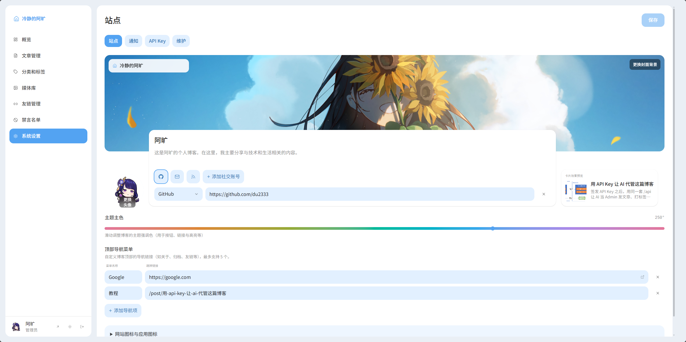

<div align="center">

中文 | [English](./docs/README.en.md)

# Flare Stack Blog

基于 **Cloudflare Workers** 的全栈现代化博客 CMS<br>
深度集成 D1、R2、KV、Queues 等 Serverless 服务

[](https://github.com/du2333/flare-stack-blog/blob/main/LICENSE)
[](https://github.com/du2333/flare-stack-blog/stargazers)
[](https://github.com/du2333/flare-stack-blog/network/members)
[](https://react.dev)
[](https://tanstack.com/start)
[](https://tailwindcss.com)

[演示站点](https://blog.dukda.com) · [部署指南](#部署指南) · [本地开发](#本地开发) · [开发规范](./docs/error-handling-quickstart.md)

</div>

---

> **注意**：本项目专为 Cloudflare 生态设计，**仅支持**部署在 Cloudflare Workers。

> 建了个 Telegram 群组，欢迎交流本项目相关问题 [Telegram 群](https://t.me/+vWuQYybv1kgxMDkx)

## 界面预览

<div align="center">
  
  
</div>

## 核心功能

- **文章管理** — 富文本编辑器，支持代码高亮、图片上传、草稿/发布流程
- **版本历史** — 编辑器自动快照与文章版本回溯，方便恢复误改内容
- **标签系统** — 灵活的文章分类
- **评论系统** — 支持嵌套回复、邮件通知
- **友情链接** — 用户申请、管理员审核、邮件通知
- **通知系统** — 支持邮件与 Webhook 多通道通知，可按事件订阅
- **全文搜索** — 基于 Orama 的高性能搜索
- **媒体库** — R2 对象存储，图片管理与优化
- **用户认证** — GitHub OAuth 登录，权限控制
- **数据统计** — Umami 负责访问分析，系统每日同步文章热度用于首页排序
- **SEO 增强** — Canonical URL、Schema.org 结构化数据、RSS / Sitemap / Robots

## 技术栈

### Cloudflare 生态

| 服务            | 用途                           |
| :-------------- | :----------------------------- |
| Workers         | 边缘计算与托管                 |
| D1              | SQLite 数据库                  |
| R2              | 对象存储（媒体文件）           |
| KV              | 缓存层                         |
| Durable Objects | 分布式限流                     |
| Queues          | 消息队列（邮件通知）           |
| Images          | 图片优化                       |

### 前端

- **框架**：React 19 + TanStack Router/Query
- **样式**：TailwindCSS 4
- **表单**：React Hook Form + Zod
- **图表**：Recharts

### 后端

- **入口**：TanStack Start（SSR、页面路由、非 JSON HTTP）
- **JSON API**：oRPC OpenAPI（显式 method/path，挂在 `/api`）
- **认证**：Better Auth（`/api/auth/*`，GitHub OAuth）
- **数据库**：Drizzle ORM + drizzle-zod

### 编辑器

TipTap 富文本 + Shiki 代码高亮

### 目录结构

```
src/
├── features/
│   ├── posts/                  # 文章管理（其他模块结构类似）
│   │   ├── api/                # Server Functions（对外接口）
│   │   ├── data/               # 数据访问层（Drizzle 查询）
│   │   ├── posts.service.ts    # 业务逻辑
│   │   ├── posts.schema.ts     # Zod Schema + 缓存 Key 工厂
│   │   ├── components/         # 功能专属组件
│   │   └── queries/            # TanStack Query Hooks
│   ├── comments/    # 评论、嵌套回复
│   ├── tags/        # 标签管理
│   ├── media/       # 媒体上传、R2 存储
│   ├── search/      # Orama 全文搜索
│   ├── auth/        # 认证、权限控制
│   ├── dashboard/   # 管理后台数据统计
│   ├── email/       # 邮件通知（Resend）
│   ├── cache/       # KV 缓存服务
│   ├── config/      # 博客配置
│   ├── friend-links/# 友情链接（申请、审核）
│   ├── version/     # 版本更新检查
├── routes/
│   ├── _public/     # 公开页面（首页、文章列表/详情、搜索）
│   ├── _auth/       # 登录/注册相关页面
│   ├── _user/       # 用户相关页面
│   ├── admin/       # 管理后台（文章、评论、媒体、标签、设置）
│   ├── rss[.]xml.ts     # RSS Feed
│   ├── sitemap[.]xml.ts # Sitemap
│   └── robots[.]txt.ts  # Robots.txt
├── components/      # UI 组件（ui/, common/, layout/, tiptap-editor/）
├── lib/             # 基础设施（db/, auth/, hono/, middlewares）
└── hooks/           # 自定义 Hooks
```

### 公开页面

面向读者的页面使用 Fuwari 这一套表现。标题、描述、社交链接、favicon、首页背景、头像和主色相在后台“设置”里改。`src/blog.config.ts` 是默认值和兜底。


### 请求流程

```
请求 → server.ts（TanStack Start）
         ├── /api/auth/* → Better Auth
         ├── /api/*      → oRPC OpenAPI
         ├── /images/*   → R2 媒体服务
         └── 页面        → 路由匹配 + Loader
                              ↓
                  KV Public Cache ←→ Service 层 ←→ D1
                              ↓
                         SSR 渲染
```

## 部署指南

请参考 **[Flare Stack Blog 部署教程](https://blog.dukda.com/post/flare-stack-blog%E9%83%A8%E7%BD%B2%E6%95%99%E7%A8%8B)**，包含 Cloudflare 资源创建、凭证获取、GitHub OAuth 配置、两种部署方式的详细图文步骤及常见问题排查。

**[视频教程](https://www.bilibili.com/video/BV1R4fnBhEs4?p=2)** 已上线

---

## 环境变量参考

| 文件        | 用途                                   |
| :---------- | :------------------------------------- |
| `.env`      | 客户端变量（`VITE_*`），Vite 读取      |
| `.dev.vars` | 服务端变量，Wrangler 注入 Worker `env` |

### 必填

| 变量名                       | 用途   | 说明                                              |
| :--------------------------- | :----- | :------------------------------------------------ |
| `CLOUDFLARE_API_TOKEN`       | CI/CD  | Cloudflare API Token（Worker 部署 + D1 读写权限） |
| `CLOUDFLARE_ACCOUNT_ID`      | CI/CD  | Cloudflare Account ID                             |
| `D1_DATABASE_ID`             | CI/CD  | D1 数据库 ID                                      |
| `KV_NAMESPACE_ID`            | CI/CD  | KV 命名空间 ID                                    |
| `BUCKET_NAME`                | CI/CD  | R2 存储桶名称                                     |
| `BETTER_AUTH_SECRET`         | 运行时 | 会话加密密钥，运行 `openssl rand -hex 32` 生成    |
| `BETTER_AUTH_URL`            | 运行时 | 应用 URL（如 `https://blog.example.com`）         |
| `ADMIN_EMAIL`                | 运行时 | 管理员邮箱                                        |
| `GITHUB_CLIENT_ID`           | 运行时 | GitHub OAuth Client ID                            |
| `GITHUB_CLIENT_SECRET`       | 运行时 | GitHub OAuth Client Secret                        |
| `DOMAIN`                     | 运行时 | 博客域名（如 `blog.example.com`）                 |

### 可选

| 变量名                    | 用途   | 说明                                                                                                      |
| :------------------------ | :----- | :-------------------------------------------------------------------------------------------------------- |
| `TURNSTILE_SECRET_KEY`    | 运行时 | Cloudflare Turnstile 人机验证 Secret Key                                                                  |
| `VITE_TURNSTILE_SITE_KEY` | 构建时 | Cloudflare Turnstile Site Key                                                                             |
| `GITHUB_TOKEN`            | 运行时 | GitHub API Token（版本更新检查，避免限流）                                                                |
| `LOCALE`                  | 运行时 | 默认语言，支持 `zh` / `en`，默认 `zh`；认证邮件、通知邮件、Webhook 文本和后台异步任务文案会使用该语言；页面 UI 语言仍由 cookie 切换 |
| `ROUTE`                   | CI/CD  | 设为 `1` 时，GitHub Actions 部署自动改用 Cloudflare `routes` 模式                                        |
| `ZONE_NAME`               | CI/CD  | 可选。仅在 `ROUTE=1` 且 Zone 不是从 `DOMAIN` 自动推导结果时填写                                           |
| `UMAMI_SRC`               | 运行时 | Umami 埋点代理地址；自托管模式下也作为默认 API 基础地址                                                   |
| `VITE_UMAMI_WEBSITE_ID`   | 构建时 | 客户端埋点使用的 Umami Website ID                                                                         |
| `UMAMI_WEBSITE_ID`        | 运行时 | Worker 热度同步使用的 Umami Website ID，应与客户端 ID 一致                                                |
| `UMAMI_API_URL`           | 运行时 | 可选 API 地址覆盖；Cloud 默认 `https://api.umami.is/v1`，自托管默认 `${UMAMI_SRC}/api`                    |
| `UMAMI_API_KEY`           | 运行时 | Umami Cloud API Key，与自托管用户名/密码二选一                                                            |
| `UMAMI_USERNAME`          | 运行时 | 自托管 Umami 用户名，需与 `UMAMI_PASSWORD` 同时配置                                                       |
| `UMAMI_PASSWORD`          | 运行时 | 自托管 Umami 密码                                                                                          |

---

## 本地开发

### 前置要求

- [Bun](https://bun.sh) >= 1.3
- Cloudflare 账号（用于远程 D1/R2/KV 资源）

### 快速开始

```bash
# 安装依赖
bun install

# 配置环境变量
cp .env.example .env        # 客户端变量
cp .dev.vars.example .dev.vars  # 服务端变量

# 配置 Wrangler
cp wrangler.example.jsonc wrangler.jsonc
# 编辑 wrangler.jsonc，填入你的资源 ID
# 默认示例使用 custom_domain，也可以改成 routes 模式（如 blog.example.com/*）

# 启动开发服务器
bun dev
```

### 登录管理后台

**方式一：邮箱密码注册（无需第三方服务）**

1. 访问 `http://localhost:3000` 注册页面，使用 `.dev.vars` 中配置的 `ADMIN_EMAIL` 注册账号
2. 开发环境下验证邮件不会真正发送，验证链接会打印到控制台，复制访问即可完成验证
3. 验证后自动登录，系统根据 `ADMIN_EMAIL` 自动赋予管理员权限

**方式二：GitHub OAuth**

1. 前往 [GitHub Developer Settings](https://github.com/settings/developers) 创建一个 OAuth App
2. Homepage URL 填 `http://localhost:3000`，Authorization callback URL 填 `http://localhost:3000/api/auth/callback/github`
3. 将 Client ID 和 Client Secret 填入 `.dev.vars`

### 常用命令

| 命令            | 说明                        |
| :-------------- | :-------------------------- |
| `bun dev`       | 启动开发服务器（端口 3000） |
| `bun run build` | 构建生产版本                |
| `bun run test`  | 运行测试                    |
| `bun lint`      | Oxlint 检查                 |
| `bun check`     | 类型检查 + Lint + 格式化    |

### 数据库命令

| 命令              | 说明                                |
| :---------------- | :---------------------------------- |
| `bun db:studio`        | 启动 Drizzle Studio（可视化数据库） |
| `bun db:generate`      | 生成迁移文件                        |
| `bun db:migrate`       | 应用远程 D1 迁移                    |
| `bun db:migrate:local` | 应用本地 D1 迁移                    |

### 本地模拟 Cloudflare 资源

默认配置使用远程 D1/R2/KV 资源。如需完全本地开发，可在 `wrangler.jsonc` 中移除 `remote: true`，Miniflare 会自动模拟这些服务：

```jsonc
{
  "d1_databases": [{ "binding": "DB", ... }],  // 移除 "remote": true
  "r2_buckets": [{ "binding": "R2", ... }],    // 移除 "remote": true
  "kv_namespaces": [{ "binding": "KV", ... }]  // 移除 "remote": true
}
```

> **注意**：本地模拟的数据不会同步到远程，适合初期开发和测试。本地数据库迁移推荐使用：
>
> ```bash
> bun db:migrate:local
> ```

### 域名绑定方式

默认配置使用 `custom_domain`。如果你希望使用 `routes` 方式接管 `blog.example.com/*`，可改成：

```jsonc
{
  "routes": [{ "pattern": "blog.example.com/*", "zone_name": "example.com" }]
}
```

使用仓库内置 GitHub Actions 部署时，不必手改 `wrangler.example.jsonc`：

- 默认：`custom_domain`
- 设置仓库变量 `ROUTE=1`：自动切到 `routes`
- `pattern` 自动使用 `${DOMAIN}/*`
- `zone_name` 默认从 `DOMAIN` 推导；如有子域单独托管场景，可额外设置 `ZONE_NAME`

## 贡献

欢迎贡献代码、报告问题或提出建议！请查看 [CONTRIBUTING.md](./CONTRIBUTING.md) 了解开发指南和代码规范。

开始改动业务前，建议先阅读 [错误处理与 Result 模式快速上手](./docs/error-handling-quickstart.md)。
